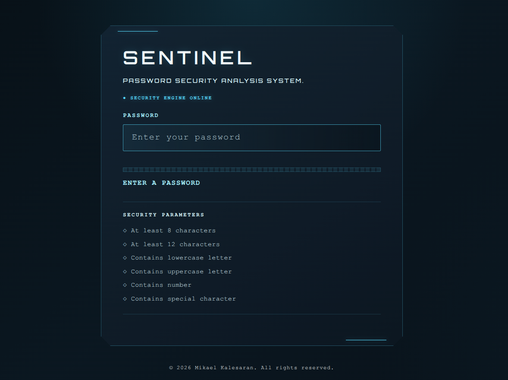

# SENTINEL

### Password Security Analysis System

SENTINEL is a lightweight, client-side password security analyzer built to explore practical cybersecurity concepts through a simple, real-time interface.

It evaluates password complexity, identifies predictable patterns, checks against commonly used passwords, and provides a theoretical entropy estimate — all locally in the browser.

---

## Preview



---

## Features

- **Real-time password analysis**
- **Complexity evaluation**
  - Minimum length
  - Lowercase characters
  - Uppercase characters
  - Numbers
  - Special characters
- **Common-password detection**
- **Repeated-character detection**
- **Sequential-pattern detection**
- **Keyboard-pattern detection**
- **Estimated password entropy**
- **Combined security scoring**
- **Local client-side processing**
- **Responsive JARVIS-inspired interface**

---

## How It Works

SENTINEL evaluates a password through several independent security signals.

### Complexity

The analyzer checks whether the password contains different character types and meets the required length thresholds.

```text
Length
Lowercase
Uppercase
Numbers
Special Characters
```

These checks form the initial complexity score.

### Predictability

A password can satisfy conventional complexity requirements while still being easy to guess.

SENTINEL therefore checks for patterns such as:

```text
123
1234
abcdef
qwerty
aaaaaa
```

It also checks against a small collection of commonly used passwords.

### Entropy

SENTINEL provides an estimated theoretical entropy based on password length and the estimated character-set size.

The calculation is approximately:

```text
Entropy ≈ Length × log₂(Character Set Size)
```

Entropy is presented as an estimate rather than a definitive measurement of real-world password security.

### Final Assessment

The individual signals are combined into a final strength assessment.

```text
                 Password
                     │
                     ▼
             ┌───────────────┐
             │   Complexity  │
             └───────┬───────┘
                     │
             ┌───────▼───────┐
             │ Predictability│
             └───────┬───────┘
                     │
             ┌───────▼───────┐
             │    Entropy    │
             └───────┬───────┘
                     │
                     ▼
             Final Assessment
```

---

## Privacy

SENTINEL performs password analysis locally in the browser.

Passwords are not submitted to a backend server by the application.

This makes SENTINEL suitable for experimenting with password-analysis concepts without transmitting the entered password to a remote service.

---

## Technology

| Technology | Purpose |
|---|---|
| HTML5 | Application structure and entry point |
| CSS3 | Interface and JARVIS-inspired visual design |
| JavaScript | Password analysis and real-time interaction |

No backend, database, or PHP runtime is required.

---

## Running Locally

### Requirements

- A modern web browser
- Git

### Installation

Clone the repository:

```bash
git clone https://github.com/biasedfilms/sentinel.git
```

Enter the project directory:

```bash
cd SENTINEL
```

Start a local static server:

```bash
python3 -m http.server 8000
```

Open:

```text
http://localhost:8000
```

Alternatively, the application can be opened directly through `index.html` in a modern browser.

---

## Live Demo

[**Launch SENTINEL →**](https://biasedfilms.github.io/sentinel/)

Run SENTINEL directly in your browser. No installation required.

---

## Project Structure

```text
SENTINEL/
├── index.html
├── script.js
├── style.css
├── common-passwords.js
├── assets/
│   └── sentinel-preview.png
├── README.md
├── LICENSE
└── .gitignore
```

---

## Security Notes

SENTINEL is an **educational cybersecurity project**.

Its password scoring, pattern detection, and entropy calculations are heuristic implementations intended for learning and demonstration.

They should not be treated as a replacement for established password-security auditing systems, breach databases, password managers, or professional security tools.

In particular, theoretical entropy does not account for every factor an attacker may use when guessing a password.

---

## Learning Objectives

SENTINEL was built as a practical project for exploring concepts including:

- Password security
- Password complexity
- Predictability
- Pattern recognition
- Regular expressions
- Entropy
- Client-side JavaScript
- Input validation
- Security-oriented UI design

---

## Roadmap

The initial release focuses on the core password-analysis engine.

Future versions may explore:

- Improved password dictionaries
- More advanced pattern recognition
- Better password-strength heuristics
- Additional security metrics
- Accessibility improvements
- Automated testing

---

## License

Copyright © 2026 Mikael Kalesaran.

SENTINEL is released under the [MIT License](LICENSE).
